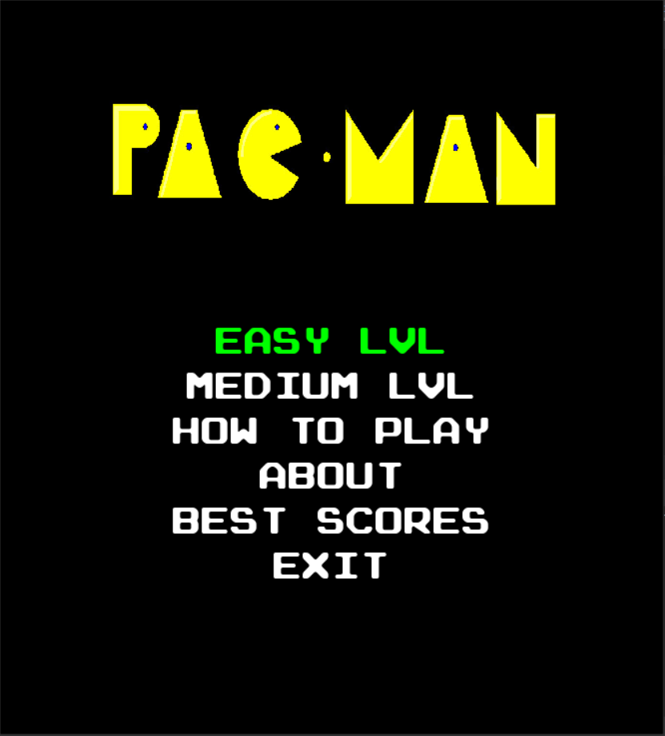
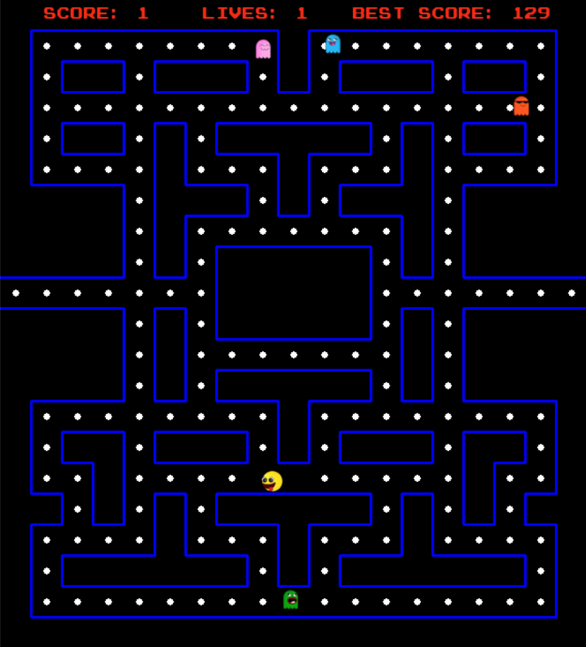
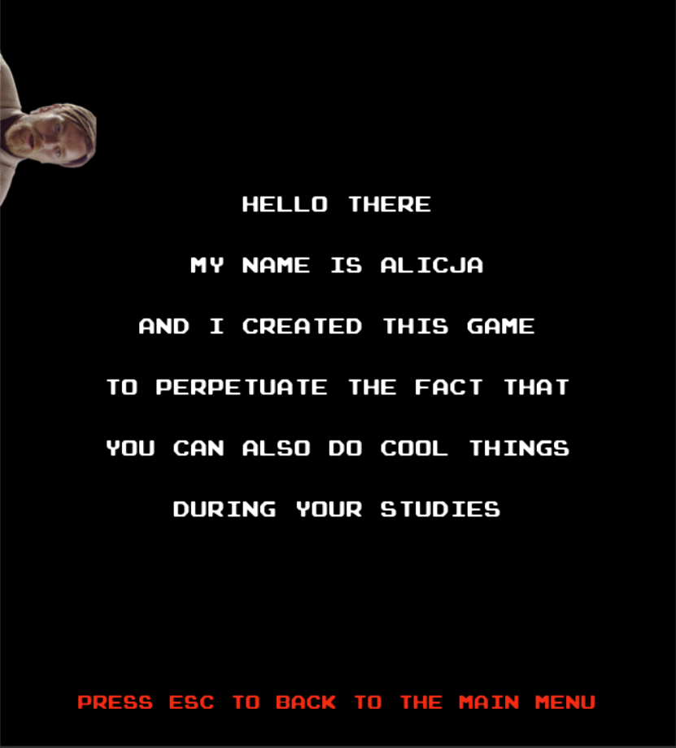

# Pacman_AlutkaEdition
## Author: Alicja Myśliwiec
### Description:
Pacman is a classic maze action game in which you have to eat all the dots while avoiding ghosts.  

### Technologies 

**pygame** 2.0.1

### How to run this code

Clone the template project, replacing my-project with the name of the project you are creating: 

`git clone https://github.com/AlutkaMalutka/Pacman_AlutkaEdition.git my-project`

`cd my-project`

Install the project's development and runtime requirements: `pip install -r requirements.txt`
